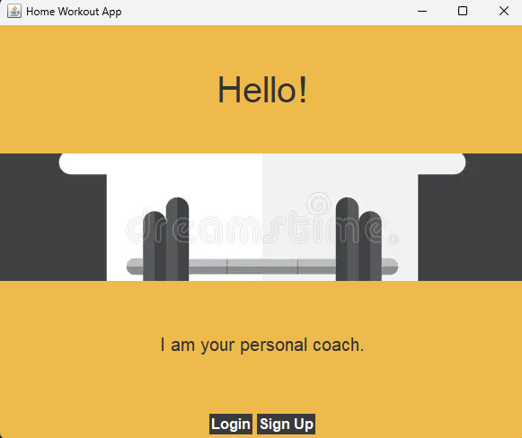
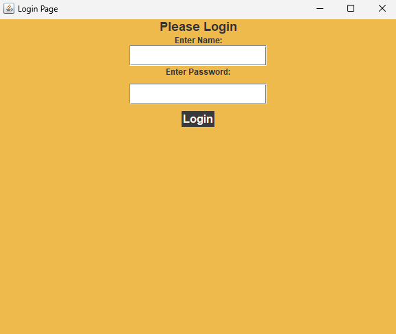
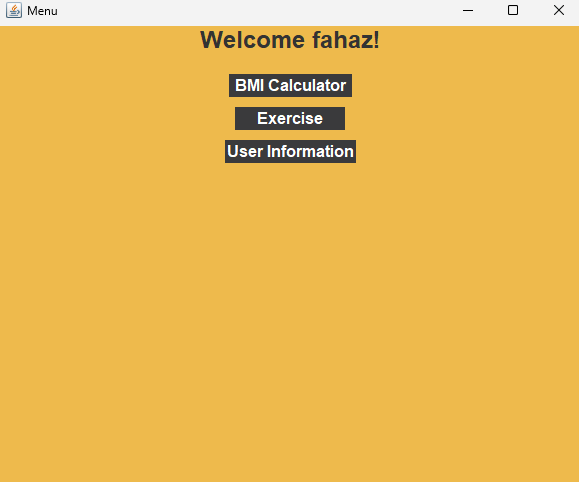

## 🏋️‍♂️ Home Workout Application

### Object-Oriented Programming Project (UIT)

A Java-based desktop fitness application that helps users manage workouts, track BMI, and stay motivated — built using **Object-Oriented Programming principles** and **Java Swing GUI**.

---

## 📸 Application Preview

### 🏠 Home Screen


### 🔐 Login Page


### 📋 Menu Dashboard


---

## 🎥 Demo Video

[▶️ Watch Demo Video](./Home%20Workout%20App(Video).mp4)

---

## 🚀 Features

* 🔐 **User Authentication** (Login / Signup)
* ⚖️ **BMI Calculator**
* 🎯 **Personalized Workout Plans**
* 📅 **Weekly Exercise Schedule**
* ✨ **Motivational Tips & UI**

---

## 🏗️ Project Structure

```
src/main/java/com/mycompany/fttnesstracker/
```

* `Fittnesstracker.java` → Entry point
* `SecondPage.java` → Login/Signup
* `MenuPage.java` → Main dashboard
* `ExercisePage.java` → Workout display
* `BMICalculator.java` → Health logic

---

## 🛠️ Tech Stack

* Java
* Maven
* Swing / AWT

---

## ⚙️ How to Run (IMPORTANT)

### Using Maven:

```bash
mvn clean compile
mvn exec:java -Dexec.mainClass="com.mycompany.fttnesstracker.Fittnesstracker"
```

---

## 📂 Data Storage

User data is stored locally in:

```text
UserData.txt
```

---

## 👤 Author
**Muhammad Fahaz Khan**
*CS Undergraduate at UIT University*

- **GitHub:** [@SHADOWRULIN](https://github.com/SHADOWRULIN)
- **LinkedIn:** [Fahaz Khan](https://www.linkedin.com/in/muhammad-fahaz-khan-85b805293/)

---

## 📄 License

This project is licensed under the **MIT License**.
